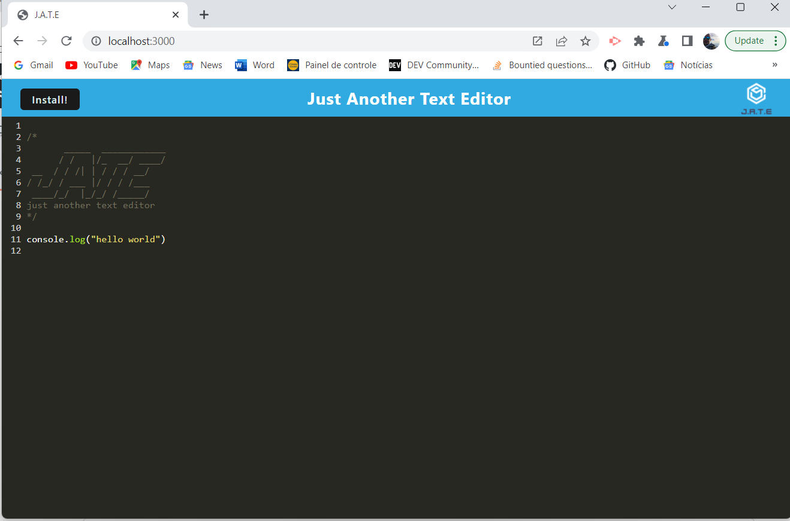
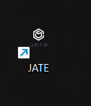

## Progressive Web Applications (PWA) Challenge: Text Editor 🗨️✉️

### User Story

```
AS A developer
I WANT to create notes or code snippets with or without an internet connection
SO THAT I can reliably retrieve them for later use
```

### Acceptance Criteria

```
GIVEN a text editor
WHEN I open the application
THEN I am presented with a text editor and a list of saved notes
WHEN I enter a note title and the note’s text
THEN a Save icon appears in the navigation at the top of the page
WHEN I click on the Save icon
THEN the note I have entered is saved and appears in the left-hand column with the other existing notes
WHEN I click on an existing note in the list in the left-hand column
THEN that note appears in the text editor
WHEN I click on the Write icon in the navigation at the top of the page
THEN I am presented with empty fields to enter a new note title and the note’s text in the text editor
``` 

### Screenshot






### Links

* [Deployed Application](https://stark-retreat-70771.herokuapp.com/)

* [GitHub Repository](https://github.com/Vinni99/text-editor)

## Installation

To install necessary dependencies, run the following command:

```
npm i
```

## Usage

To run the application, run the following command:

```
npm run start
```

